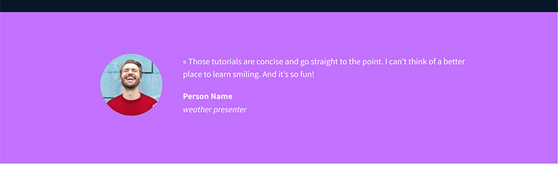

# CSS, advanced

## Purpose
Learn how to gain CSS styling from figma and expaned your general knowledge of CSS code.

## Goal
Recreate the webpage provided using CSS

## Task

#### 1. Import the style
Before starting the implementation of the Style:
+ Create the file styles.css
+ Import styles.css in the head of your index.html

#### 2. Header and Banner
Based on the Figma file, add the correct styling to the header and first section of the page

#### 3. Quotes
Based on the Figma file, add the correct styling to the quote section

#### 4. Videos list
Based on the Figma file, add the correct styling to the videos list section

#### 5. Membership
Based on the Figma file, add the correct styling to the membership section

#### 6. FAQ
Based on the Figma file, add the correct styling to the FAQ section

#### 7. Footer
Based on the Figma file, add the correct styling to the footer

#### 8. Make it live!
Yes, you made it!

You just finish to implement your first web page from a designer file, Congrats!

It’s time to deploy it in Github, by using Github Pages